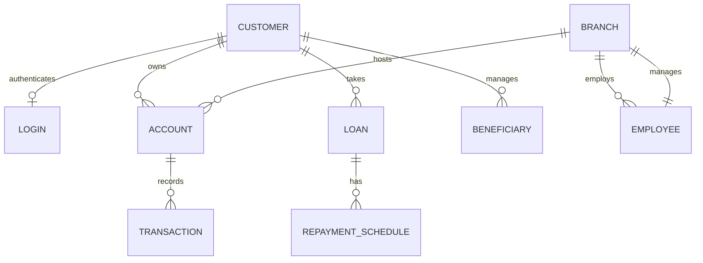

# AeroBank: Online Banking Management System (OBMS)

[](https://opensource.org/licenses/Apache-2.0)
[](https://reactjs.org/)
[](https://supabase.com/)
[](https://tailwindcss.com/)

**AeroBank** is a modern, secure, and comprehensive digital banking platform designed to digitize and centralize core financial operations. Built with a high-performance React frontend and a robust Supabase (PostgreSQL) backend, it provides role-specific portals for Customers, Employees, and Administrators.

---

## 🚀 Key Features

### 👤 Customer Portal
- **Account Management**: Real-time balance tracking, multi-account support, and mini-statement generation (PDF).
- **Fund Transfers**: Secure intra-bank and inter-bank (NEFT/RTGS) transfers with daily limit enforcement.
- **Beneficiaries**: Manage payees with a 24-hour security cooling period and custom transfer limits.
- **Loan Module**: End-to-end loan application, real-time status tracking, and automated EMI repayment schedules.
- **Security**: Self-service password reset via OTP and session management.

### 💼 Admin & Staff Portal
- **Dashboard**: Real-time KPI monitoring, pending loan counters, and flagged account alerts.
- **Loan Approval**: Centralized workflow for reviewing, approving, or rejecting loan applications.
- **User Oversight**: Freeze/unfreeze accounts, manage employee records, and update branch details.
- **Audit Logs**: Comprehensive, non-repudiable audit trail of all sensitive system events.
- **Financial Analytics**: High-level overview of bank-wide transactions and loan performance.

### 🛡️ Core Banking Engine
- **ACID Transactions**: Atomic fund transfers enforced at the database level via PostgreSQL transactions.
- **Security First**: Row-Level Security (RLS) ensures data isolation; encrypted credentials and JWT-based RBAC.
- **Automated Workflows**: Automatic EMI generation, overdue loan flagging, and recurring standing instructions.

---

## 🛠️ Technology Stack

| Layer | Technology | Details |
| :--- | :--- | :--- |
| **Frontend** | React 18, Vite | Component-based SPA with TypeScript |
| **Styling** | Tailwind CSS, shadcn/ui | Utility-first CSS and modern UI components |
| **Backend** | Supabase | Auth, Database, Edge Functions, and Realtime |
| **Database** | PostgreSQL | 3NF Normalized, ACID-compliant relational DB |
| **State Management** | TanStack Query | Efficient server-state management and caching |
| **Forms/Validation** | Hook Form + Zod | Schema-based client-side validation |
| **Charts** | Recharts | Interactive financial data visualization |

---

## 📂 Project Structure

```text
Banking-Management/
├── database/               # Database SQL migrations and schema
│   └── schema.sql          # Core 3NF schema, triggers, and functions
├── frontend/               # React Application Source
│   ├── src/
│   │   ├── components/     # Reusable UI components (Shared, Layouts)
│   │   ├── contexts/       # Auth and Global State contexts
│   │   ├── lib/            # Supabase client and utility functions
│   │   ├── pages/          # Main application views
│   │   │   └── admin/      # Administrator-specific portals
│   │   └── App.tsx         # Routing and Main App Entry
│   ├── tailwind.config.ts  # Design system configuration
│   └── vite.config.ts      # Build and Dev server config
├── PRD_OBMS.md             # Detailed Product Requirements
└── LICENSE                 # Apache 2.0 License
```

---

## 🏗️ Getting Started

### Prerequisites
- [Node.js](https://nodejs.org/) (v18 or higher)
- [npm](https://www.npmjs.com/) or [pnpm](https://pnpm.io/)
- A [Supabase](https://supabase.com/) project (Free or Pro tier)

### Installation

1.  **Clone the Repository**:
    ```bash
    git clone https://github.com/your-repo/banking-management.git
    cd banking-management
    ```

2.  **Database Setup**:
    - Navigate to your Supabase SQL Editor.
    - Copy and execute the contents of `database/schema.sql` to initialize tables, triggers, and RLS policies.

3.  **Frontend Setup**:
    ```bash
    cd frontend
    npm install
    ```

4.  **Environment Variables**:
    Create a `.env.local` file in the `frontend` directory:
    > ⚠️ **Security Warning**: Never commit `.env.local` to version control. Add it to `.gitignore` and use `.env.example` as a template.

    ```env
    VITE_SUPABASE_URL=your_supabase_project_url
    VITE_SUPABASE_ANON_KEY=your_supabase_anon_key
    ```

### Running Locally
```bash
npm run dev
```
The application will be available at `http://localhost:5173`.

---

## 🗺️ Database Design

The system is built on 9 core tables normalized to **3NF** to ensure zero redundancy and maximum integrity.



| Entity | Primary Key | Description |
| :--- | :--- | :--- |
| **Customer** | `customer_id` | Profile and contact information |
| **Account** | `account_id` | Savings/Current account with branch link |
| **Transaction** | `transaction_id` | Ledger of all financial movements |
| **Loan** | `loan_id` | Loan lifecycle (Pending to Closed) |
| **Branch** | `branch_id` | Physical branch details |
| **Login** | `login_id` | Authentication credentials for customers |
| **Beneficiary** | `beneficiary_id` | Saved payees with transfer limits |
| **Repayment Schedule** | `schedule_id` | EMI payment schedules for loans |
| **Employee** | `employee_id` | Staff and admin user records |
---

## 👥 Prepared By
- **Johan Andrews** (KTE24CS076)
- **Roopesh Krishnan** (KTE24CS115)
- **Sreya Binoi** (KTE24CS129)

*APJ Abdul Kalam Technological University*

---

## 📄 License
Licensed under the [Apache License, Version 2.0](LICENSE).
